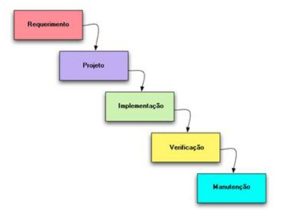

# Metodologia

Pré-requisitos: <a href="2-Especificação do Projeto.md"> Documentação de Especificação</a>

O modelo de processo adotado no processo é o modelo Cascata. A escolha deste modelo ocorreu devido ao mesmo ser aplicável a sistemas cujos requisitos são bem definidos e pelo fato de exigir uma documentação mais rígida e completa, ideal nesse caso, já que se trata de um trabalho acadêmico. Além disso, uma vantagem adicional de se utilizar esse modelo é o fato de o desenvolvimento de software se dará ao longo da disciplina de Projeto cuja ementa segue o modelo cascata. Desta forma, na medida com que as aulas avançam, as tarefas a serem desenvolvidas acompanham o conteúdo estudado.

Desta forma, todas as etapas envolvidas no processo de desenvolvimento do software serão descritas na órdem com que são mencionadas no diagrama do modelo cascata, representado à seguir:

Segundo o modelo definido acima, a estruturação do documento se dá em seções nas quais em cada uma serão apresentados os resultados do desenvolvimento de cada uma das atividades que compõem o modelo Cascata. Além disso, a padronização dos diagramas de UML se dará por meio da utiulização da ferramenta Draw.io para o desenvolvimento e compartilhamento de todas as representações. Outra decisão importante foi manter a IDE visual Code e o repositório do GitHub para o desenvolvimento e compartilhamento de todo projeto.

## Controle de Versão

A ferramenta de controle de versão adotada no projeto foi o
[Git](https://git-scm.com/), sendo que o [Github](https://github.com)
foi utilizado para hospedagem do repositório.

O projeto segue a seguinte convenção para o nome de branchs:

- `Main`: versão estável já testada do software
- `Homologação`: versão desenvolvida e em fase de testes.
- `Desenvolvimento`: versão em desenvolvimento

Quanto à gerência de issues, o projeto adota a seguinte convenção para
etiquetas:

- `documentação`: melhorias ou acréscimos à documentação
- `bug`: uma funcionalidade encontra-se com problemas
- `melhorias`: uma funcionalidade precisa ser melhorada
- `funcionalidade`: uma nova funcionalidade precisa ser introduzida

Discuta como a configuração do projeto foi feita na ferramenta de versionamento escolhida. Exponha como a gerência de tags, merges, commits e branchs é realizada. Discuta como a gerência de issues foi realizada.

## Gerenciamento de Projeto

Apesar de usarmos o modelo cascata, dadas às limitações impostas pela estrutura da disciplina, a equipe introduz processos de metodologias ágeis em cada etapa e se divide conforme se segue:

### Divisão de Papéis

A equipe está organizada da seguinte maneira:
Scrum Master: Janaina Jamarino Rosa
Product Owner: Flávio Duarte Carvalho
Equipe de Desenvolvimento e Design:
Leandro David Metzker
Luiza Jamarino Rosa Grigório
Platini Gomes da Rocha
Priscilha Alves

### Processo

Para organização e distribuição das tarefas do projeto, a equipe está utilizando o Automated Kanban no próprio GitHub, estruturado com as seguintes listas: 

Backlog: recebe as tarefas a serem trabalhadas e representa o Product Backlog. Todas as atividades identificadas no decorrer do projeto também devem ser incorporadas a esta lista.
To Do: Esta lista representa o Sprint Backlog. Este é o Sprint atual que estamos trabalhando.
Doing: Quando uma tarefa tiver sido iniciada, ela é movida para cá.
Done: nesta lista são colocadas as tarefas que passaram pelos testes e controle de qualidade e estão prontos para ser entregues ao usuário. Não há mais edições ou revisões necessárias, ele está agendado e pronto para a ação.

O quadro kanban do grupo no GitHub está disponível na URL Planejamento do Projeto (github.com) e é apresentado, no estado atual, na Figura X. A definição desta estrutura se baseou na proposta feita por Littlefield (2016).

### Ferramentas

Relação de Ambientes de Trabalho:

AMBIENTE: Repositório de código fonte - PLATAFORMA: GitHub - LINK DE ACESSO: https://github.com/ICEI-PUC-Minas-PMV-ADS/pmv-ads-2021-1-e1-proj-web-t4-notfy

AMBIENTE: Documentos do Projeto - PLATAFORMA: Google Drive - LINK DE ACESSO: https://drive.google.com/drive/folders/10HNldqxvMJU2gMgoVKLvsbEcBZy8yA3z?usp=sharing

AMBIENTE: Projeto de Interface e Wireframes - PLATAFORMA: Figma - LINK DE ACESSO: https://www.figma.com/file/0wLeTFn99dQOVJLFLxnZgq/Untitled?node-id=0%3A1

AMBIENTE: Gerenciamento do Ptojeto - PLATAFORMA: GitHub - LINK DE ACESSO: https://github.com/ICEI-PUC-Minas-PMV-ADS/pmv-ads-2021-1-e1-proj-web-t4-notfy

